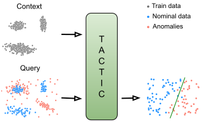

# TACTIC for Navigating the Unknown: Tabular Anomaly deteCTion via In-Context inference
Code repository for "TACTIC for Navigating the Unknown: Tabular Anomaly deteCTion via In-Context inference"
([https://arxiv.org/abs/2603.14171](https://arxiv.org/abs/2603.14171))

This repository is based on TabForestPFN ([https://github.com/FelixdenBreejen/TabForestPFN](https://github.com/FelixdenBreejen/TabForestPFN))
and ADBench ([https://github.com/Minqi824/ADBench](https://github.com/Minqi824/ADBench)) codebases.

## Abstract

Anomaly detection for tabular data has been a long-standing unsupervised learning problem that remains a major challenge 
for current deep learning models. Recently, in-context learning has emerged as a new paradigm that has shifted efforts 
from task-specific optimization to large-scale pretraining aimed at creating foundation models that generalize across 
diverse datasets. Although in-context models, such as TabPFN, perform well in supervised problems, their learned 
classification-based priors may not readily extend to anomaly detection.

In this paper, we study in-context models for anomaly detection and show that the unsupervised extensions to TabPFN2 
exhibit unstable behavior, particularly in noisy or contaminated contexts, in addition to the high computational cost. 
We address these challenges and introduce TACTIC, an in-context anomaly detection approach based on pretraining with 
anomaly-centric synthetic priors that provides fast, data-dependent reasoning about anomalies while avoiding 
dataset-specific tuning. In contrast to typical score-based approaches, which produce uncalibrated anomaly scores 
that require post-processing (e.g. threshold selection or ranking heuristics), the proposed model is trained 
as a discriminative predictor, enabling unambiguous anomaly decisions in a single forward pass.

Through experiments on real-world datasets, we examine the performance of TACTIC in clean and noisy contexts, 
varying anomaly rates and different anomaly types, as well as the impact of prior choices on detection quality. 
Our experiments clearly show that specialized anomaly-centric in-context models are an optimal approach and 
are highly competitive with task-specific predictors.



## Setup

Install environment via conda:

```setup
conda create -n tactic python=3.11
conda activate tactic

pip install -r requirements.txt
```

## Pre-training
Pre-training hyperparameters are defined in the [config/pretrain.yaml](config/pretrain.yaml) file.

To start the pre-training process, run:

```bash
python pretrain.py
```

## Evaluation
To test the clean and noisy variants of TACTIC, first download the checkpoints 
from [Google Drive](https://drive.google.com/drive/folders/1zVm-pAKDYJzX_Z45K2nW-4k5Fm6UE5c5?usp=sharing)
and put them in the [checkpoint](checkpoint) folder. Afterwards, download the dataset folders (`Classical`, `CV_by_ResNet18`, 
`CV_by_ViT`, `NLP_by_BERT`, `NLP_by_RoBERTa`), along with `test_gmm_datasets.pt` from the same Google Drive 
[link](https://drive.google.com/drive/folders/1zVm-pAKDYJzX_Z45K2nW-4k5Fm6UE5c5?usp=sharing). 
Place first five folders inside [tactic/evaluate/datasets/real](tactic/evaluate/datasets/real) and 
move `test_gmm_datasets.pt` to [tactic/evaluate/datasets/synthetic_data](tactic/evaluate/datasets/synthetic_data) directory.

Then, to assess TACTIC-clean, execute:
```bash
python evaluate.py --config-name evaluate_clean
```

And, to evaluate the TACTIC-noisy, run:
```bash
python evaluate.py --config-name evaluate_noisy
```
